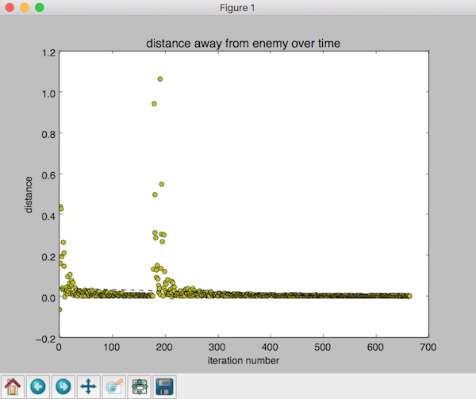

## Video
__QProtector explaination__

[](https://www.youtube.com/watch?v=cCukw-aNZqQ)


__QProtector Demo__

[](https://www.youtube.com/watch?v=-CEZVFLR7oA)


## Project Summary
For our project we set out with the goal to create an AI that would protect an entity in MineCraft. We saw a problem in MineCraft that if you were not in Creative Mode you could be attacked by other creates, what we wanted to do was create an AI that would protect an entity for other creatures.
This idea was put into practice by us creating an AI through Malmo that would allow us to protect a Villager from a Zombie that wanted to attack it, thus we created QProtector.
The setup of QProtector is us putting an ususpecting Villager into an arena with a Zombie that wants to kill it. Our agent is also spawned inside the region and given the task of keeping the Villager safe and dispatching the Zombie. After weeks of development, we have been able to construct a model that is able to balance both the concept of keeping near a villager, and defeating mobs that are of danger.


## Approaches
For our project we are using Reinforcement Learning, particularly Q-Learning and implementing Q-SARSA as our updating function.
In the begining of our project we began with an approach of using a q_table to learn off of, however with such as large state space
we have now chosen to use function approximation instead, using a Stochastic Gradient Descent Regressor. Our update function is again of a
generic type and is as follows:
```
q_values_current = estimator.predict(s_prime)
td_target = current_r + self.gamma * np.argmax(q_values_current)
```
We predict what the greatest reward would be from the previous state to get the q_values_current. Then we multiply the max q_values_current by gamma, our discount factor, with this
we then add current_r, our current_reward. This gives us the current reward for our state space.

Our Markov Decision Process consists of our state, player world, as the nodes and our actions are the edges, that connect in betwen different states. Currently we have four features in our state space as follows:
1. Absolute distance between Villager x-coordinate and Protector x-coordinate.
2. Absolute distance between Villager x-coordinate and Zombie x-coordinate.
3. Absolute distance between Villager z-coordinate and Protector z-coordinate.
4. Absolute distance between Villager z-coordinate and Zombie z-coordinate.

This is a fairly large state space and is harder to esitmate in size as each feature is held as a float. This is smaller however than the previous feature set that we had created.
This old state space consisted of 7 different features, is_villager_alive, villager(x,y,z), and zombie(x,y,z). We realized that about 3 of these features were superfluous and deciced
to shrink this to only have 4 state space features. We currently have 5 actions to choose from also consisting of up, down, turn left, turn right, and swing.

Our reward function has a couple of considerations:
1. Is the Protectee dead, if so large negative reward, AI failed
2. Is the Zombie dead, if so large positive reward, AI did well
3. Is the Protector getting closer to the Zombie, if so give slightly negative reward
4. Is the Protector getting closer to the Protectee, if so give a slightly positive reward
5. Is the health of the Protectee lowering, if so give negative reward

With this reward function we have had our AI begin to run towards the rescue of the Protectee, we are now begining to get it in range of attacking the zombie. The attacks are sporadic at this point, however our previous model failed to be aggressive against zombies. This required us to alter our reward function to give our AI a better indicator that we needed to kill the zombie. For this, we made two major changes:
1. Whenever a swing occurs, face the nearest zombie to ensure a hit. While doing this, we were able to change our action space from strafing to turning left and right.
2. Edit the reward function to swing more frequent, by having a slightly less negative reward, and rewarding for swings that hit zombie, regardless of if they kill.. This required us to re-evalute our initial reward values. Initially, we would have values of roughly 10k, or -10k. It was a binary reward in essence. To achieve wanting to swing, we had to discretize the reward function in order to have a sort of vary degrees of success and failure.


As mentioned earlier in the evaluation section we are now using an value approximation function, through the use of a Stochastic Gradient Descent Regressor built into sklearn.
We are using this as it is faster to train on a larger state space as it does not take into account each state and hold each state but come up with an approximation of what an
optimal state would be. This has resulted so far in slightly better training. We have worked on tweaking some of the features in the sklearn models, but we ended up utilizing the sklearn pipeline libraries because our AI seemed to achieved our desired goal much faster than the home-brewed features we had before. This would in turn have us transform the 4 features stated above, into a set of parameters defined by sklearn. Then we adjusted the gamma component parameters, using the reward function as our metric for determining better features.

## Evaluation
Similar to before, the AI initially moves around in what seems like random directions, often away from the villager as it is being attack by the zombie. However, it has been able to learn to improve its score by decreasing the distance between itself and the other entities. Once the villager has a run of both getting close to our villager and swinging, we can see the AI prefers to kill zombies, while being close to the villager (occassionally swinging at the villager as well).

#### He's Going the Distance


The image above is a plot of the average change in distance (between player and zombie) between actions over PUT NUMBER IN HERE episodes. Towards the earlier episodes, the AI has a much higher positive average, indicating that the AI is moving farther from the villager as well as the zombie it is attacking. However, we can see that there is improvement after each episode. The averages eventually become negative, which shows that the AI is able to decrease the distance between it and the zombie with each action over time.


The two plots show the time the villager stays alive in each episode and the reward at the end of each episode. With the changes to the reward function, we can better estimate the progress of our bot as he begins to understand his mission. We can see that the reward starts very negative, because the bot is almost randomly doing actions to better understand the policy. We see after time that our reward function begins to increase. Eventually, we can see spikes where he both killed the zombie, and kept the villager alive throughout the episode.

## References
For an example of Function Approximation using Stochastic Gradient Descent we used the following [Github Repo](https://github.com/dennybritz/reinforcement-learning/blob/master/FA/Q-Learning%20with%20Value%20Function%20Approximation%20Solution.ipynb).
It was quite helpful and shows how to use a built in model provided by sci-kit learn on an open AI dataset.

The ever loving [MineCraft Guide](http://minecraft.gamepedia.com/Commands) was always helpful for showing us which commands to run through the Minecraft prompt and assisted us in setting the behaviors of the entities.

A large portion of our project and the core concept of Reinforcement Learning was learned and gleaned from Sutton's textbook on the subject with a free online version [here](http://incompleteideas.net/sutton/book/the-book-1st.html).

And we would like to give a huge thanks to both Professor Singh and our great TA Moshe for assisting us with all of our questions throughout this quarter.